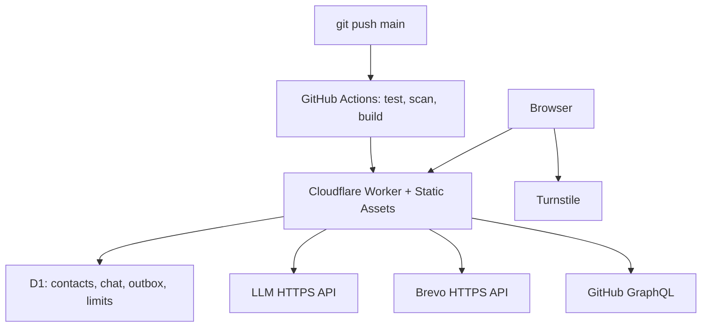

# Deployment architecture decision

Decision date: 2026-09-17. Implementation and live acceptance are separate gates.

| Architecture | GitHub deploy | Frontend / runtime / secrets | Persistence | AI / mail / GitHub | No card | Free / sleep / cold start | Decision |
|---|---|---|---|---|---|---|---|
| GitHub Pages + external API | Actions | Static Pages; external secret runtime | External DB | External HTTP API | Pages free for public repos; external signup varies | Pages 100 GB/month soft bandwidth; API varies | Viable, unnecessary split origins |
| Workers Static Assets + JS Worker + D1 | Actions | One origin, runtime secret bindings | D1 | HTTPS integrations | Free plan is default; account-specific onboarding not verified | Quota-limited free, isolates may cold start; no persistent process | Selected |
| Python Worker + D1 | Actions | Same platform, Python beta | D1 adapter needed | Async HTTPS adapters needed | As above | Free CPU budget; new WSGI support | Reconsider after beta and workload measurement |
| Render Flask + external DB | Native GitHub or CI | Flask, environment secrets | Free local disk ephemeral; Render DB expires | HTTP yes; SMTP ports blocked | Signup not verified | 750 instance hours; idle spin-down | Rejected for persistence and sleeping behavior |
| Vercel Hobby + external DB | Native GitHub or CI | Static + Python functions; secrets | External | HTTPS supported | Signup not verified | Hobby quotas, cold starts possible | Noncommercial restriction unsuitable for consulting inquiries |

The investigated platforms were checked against the operational requirements:

| Platform | Compute, memory, traffic | Sleep/cold start | Durable data | Network/email | Secrets and GitHub | Domain/TLS and use boundary |
|---|---|---|---|---|---|---|
| GitHub Pages | Static only; 100 GB/month soft bandwidth limit and ten builds/hour | No application process | None | No server-side outbound calls or email | Actions can deploy, but Pages cannot hold runtime API secrets | Custom domains and HTTPS; cannot provide this application's dynamic backend |
| Cloudflare Workers Free | 100k requests/day, 10 ms CPU/invocation, 128 MB, 50 external subrequests; static assets free/unlimited | Isolates can cold start; no sleeping server or persistent process | D1: 500 MB/database and 5 GB/account; daily row quotas; seven-day Time Travel | Outbound HTTPS supported; production uses Brevo HTTPS rather than SMTP | Encrypted Worker secrets; GitHub Actions deploy with narrow API token | `workers.dev` and custom domains with TLS; public/business Turnstile use documented; account/geographic approval untested |
| Python Workers Free | Same platform limits; Pyodide/WSGI overhead not measured in this environment | Beta runtime and package initialization add uncertainty | D1 requires an async binding adapter; SQLite filesystem is ephemeral | Current `requests`/SMTP code must become async HTTP/FFI | Same Worker secret/deploy model | Same Cloudflare boundary; rejected on maturity and unmeasured CPU rather than feature absence |
| Render Free | 0.1 CPU, 512 MB, 750 instance-hours/month; bandwidth shares workspace allowance | Sleeps after 15 idle minutes; documented spin-up around one minute; may restart anytime | Local disk ephemeral; free Postgres is 1 GB and expires after 30 days | Outbound HTTPS works; SMTP ports 25/465/587 blocked | Environment variables and Git-connected deploys supported | Custom domains/TLS; docs say Free is not for production applications; signup/card/geography untested |
| Vercel Hobby | Monthly function/transfer/build quotas; Functions currently document 2 GB/1 vCPU | Serverless cold-start behavior varies | Requires another database service | Outbound HTTPS supported; email would still need an HTTPS provider | Environment secrets and Git integration supported | Custom domains/HTTPS, but Hobby is restricted to noncommercial personal use; unsuitable for consulting inquiries |

No candidate supplies an LLM allowance. The selected runtime prevents unlimited
calls, but the chosen model/provider must independently fit the owner's ₹0
constraint or existing credit. GitHub Actions runs finite build/deploy jobs and
is never used as a web server. Codespaces is not part of production.

Selected: preserve Python/Jinja sources, build public assets without importing app/config or loading .env, deploy assets and JavaScript API together. SQLite and SMTP remain local adapters. Production uses D1 and Brevo HTTPS. Existing prompt builders and GitHub query are exported at build time into the private Worker bundle. No credentials are used during build. The browser uses one API client. Production uses same-origin requests and an HttpOnly session cookie; session IDs supplied by a visitor do not grant access to other histories. The evidence and full runtime matrix are in [PYTHON_WORKER_SPIKE.md](PYTHON_WORKER_SPIKE.md).

Official evidence:
- [GitHub Pages limits](https://docs.github.com/en/pages/getting-started-with-github-pages/github-pages-limits): static hosting; public repositories supported on Free; not a general application runtime.
- [Workers pricing](https://developers.cloudflare.com/workers/platform/pricing/): default Free plan, 100,000 dynamic requests/day, 10 ms CPU/invocation; no egress charge. Network waiting is not CPU work.
- [Workers limits](https://developers.cloudflare.com/workers/platform/limits/): 128 MB RAM, 50 external subrequests, 20,000 assets, 25 MiB/file. Load/CPU must be measured in production; local success does not prove free CPU compliance.
- [Static asset billing](https://developers.cloudflare.com/workers/static-assets/billing-and-limitations/): static requests free and unlimited, deployment includes frontend and Worker together. Only /api/* invokes Worker first.
- [D1 limits](https://developers.cloudflare.com/d1/platform/limits/): 500 MB/database on Free, 5 GB/account, 10 databases, seven-day Time Travel. [D1 pricing](https://developers.cloudflare.com/d1/platform/pricing/): 5 million rows read/day, 100,000 rows written/day; limits cause errors, not free-plan automatic paid capacity.
- [Python Workers](https://developers.cloudflare.com/workers/languages/python/) remain beta. [September 2 WSGI support](https://developers.cloudflare.com/changelog/post/2026-09-02-python-workers-web-framework-support/) means Flask is possible; it does not make SQLite disk or SMTP production-safe. JS avoids a newly introduced WSGI dependency and reduces startup/CPU risk.
- [Render Free](https://render.com/docs/free): disk ephemeral, database expires after 30 days, SMTP blocked on 25/465/587.
- [Vercel fair use](https://vercel.com/docs/limits/fair-use-guidelines): Hobby restricted to noncommercial personal use.
- [Brevo plans](https://help.brevo.com/hc/en-us/articles/208589409-About-Brevo-s-pricing-plans): Free 300 sends/day, no card, no time limit. [Transactional API](https://developers.brevo.com/reference/send-transac-email). Sender verification and account approval still required; delivery is never guaranteed. Owner + visitor consume two sends per accepted contact.
- [Resend Free](https://resend.com/docs/knowledge-base/what-is-resend-pricing): 100 emails/day; not selected. Arbitrary-recipient sending requires verified sender/domain setup.
- [Turnstile Free](https://developers.cloudflare.com/turnstile/plans/): production/business use, unlimited challenges, 20 widgets, ten hostnames/widget.

No provider signup was performed. Cloudflare card/preauthorization and geographic eligibility are NOT independently established for this account. Do not enter a card or enable paid products for this deployment; stop if onboarding requires it. No SLA or forever-free promise is made. Public portfolio use is consistent with the selected products' advertised use, subject to service terms and sanctions/account checks; India-specific signup is untested. Use the included workers.dev HTTPS hostname to avoid buying a domain. Existing/custom domains are optional and registration costs are outside hosting.

GitHub Actions performs finite CI/deployment jobs, never serves traffic. Codespaces is not used. GitHub is the control plane, Cloudflare is the runtime. No Google Drive integration: D1 export and Time Travel provide a simpler backup boundary.
