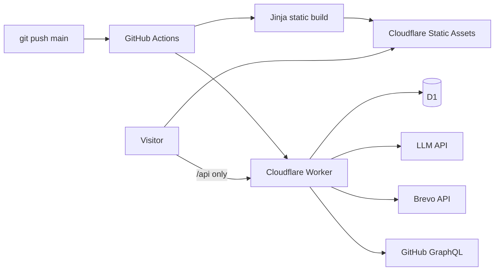

# Sanket Mane — Portfolio

A production-ready personal portfolio with a Flask development runtime and a
Cloudflare production runtime. The existing Jinja templates, CSS, GSAP motion,
Leaflet map, project filters, command palette, theme, résumé, contact form, AI
assistant, recruiter mode, and GitHub dashboard are preserved.

Production is built from the same Python/Jinja sources into static assets. Only
`/api/*` invokes the JavaScript Worker, which keeps runtime secrets in
Cloudflare, persists data in D1, calls the LLM and GitHub over HTTPS, and sends
contact email through Brevo. GitHub remains the source of truth and every push
to `main` runs the deployment workflow.



## Features

| Feature | Implementation |
|---|---|
| Portfolio UI | Jinja partials, hand-written CSS, responsive bento layout |
| Motion | Self-hosted GSAP and ScrollTrigger, with reduced-motion support |
| Map | Self-hosted Leaflet client and OpenStreetMap tiles |
| Navigation | Ctrl/Cmd+K command palette, mobile menu, internal anchors |
| Theme | Dark/light mode persisted in local storage |
| Contact | Validation, honeypot, Turnstile, D1 persistence, durable email outbox |
| AI | General and recruiter modes, signed server session, bounded D1 history |
| GitHub | Server-side GraphQL token, one-hour D1 cache, safe fallback |
| SEO | Static metadata, `robots.txt`, and `sitemap.xml` |

## Local Flask development

```powershell
python -m venv env
.\env\Scripts\Activate.ps1
python -m pip install -r requirements-dev.txt
Copy-Item .env.example .env
python app.py
```

Open <http://localhost:5000>. SQLite is created under `instance/`. The local
adapter uses SMTP and Flask sessions; blank external-service variables produce
safe fallback behavior. Never commit `.env` or the SQLite database.

On macOS or Linux, activate the environment with `source env/bin/activate`.

## Production build and local Worker

Node 24 and Python 3.13 are the tested toolchain.

```powershell
npm ci
$env:SITE_URL = "https://portfolio.example.invalid"
npm run build
Copy-Item .dev.vars.example .dev.vars
npm run dev
```

`scripts/wrangler.mjs` explicitly prevents Wrangler from reading the Flask
`.env`. Put only local Worker test values in ignored `.dev.vars`. The base
`wrangler.jsonc` contains placeholders and no credentials.

Run the verification suite with:

```powershell
npm run build
npm test
npx playwright install chromium
npm run test:e2e
npm run check:worker
python scripts/scan_secrets.py
python scripts/scan_secrets.py --public
python -m pip_audit --requirement requirements.txt
npm audit --audit-level=high
```

## Editing content

`content.py` remains the source for biography, skills, projects, coordinates,
experience, résumé content, links, and chatbot facts. Templates remain under
`templates/`, and browser assets remain under `static/`. `scripts/build.py`
renders these sources without importing `app.py`, `config.py`, or `.env`.

## Repository map

```text
content.py, templates/, static/   maintainable UI sources
app.py, blueprints/, models.py    local Flask/SQLite/SMTP adapter
worker/                           production API services and D1 adapter
migrations/                       additive D1 schema migrations
scripts/build.py                  credential-free Jinja/static build
scripts/wrangler.mjs              safe Wrangler launcher
scripts/export_sqlite_to_d1.py    private, read-only migration exporter
tests/                            Flask, build, and Worker tests
.github/workflows/                CI, security scanning, deployment
```

Use [DEPLOYMENT.md](DEPLOYMENT.md) for the first deployment and operations,
[MIGRATION.md](MIGRATION.md) for existing SQLite records,
[SECURITY.md](SECURITY.md) for the threat model and secret handling, and
[ARCHITECTURE.md](ARCHITECTURE.md) for the provider/runtime decision. The Python
Worker evidence is in [PYTHON_WORKER_SPIKE.md](PYTHON_WORKER_SPIKE.md).
